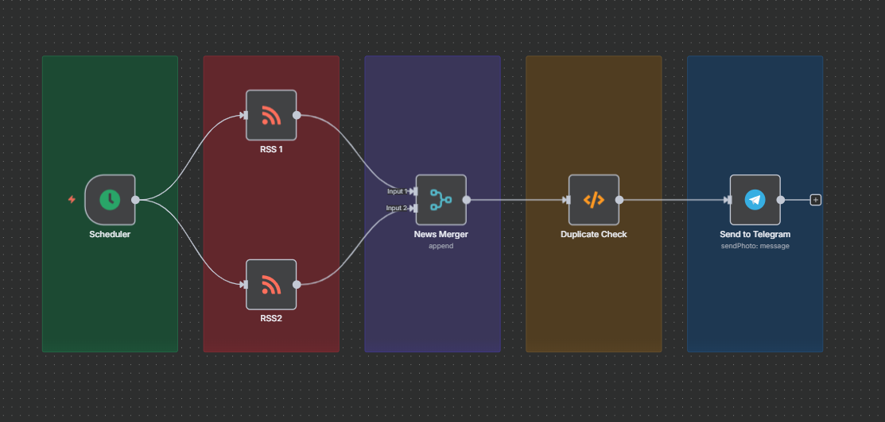

# 📡 RSS to Telegram Otomasyonu (n8n Workflow)

🌐 **Dil Seçimi:** [Türkçe](README.md) | [English](README.en.md)
---

Bu proje, **n8n** kullanarak birden fazla RSS kaynağından haberleri toplayıp **Telegram bot** üzerinden otomatik olarak paylaşan bir workflow içerir.  
Amaç: Belirli aralıklarla güncellenen haberleri, otomatik ve düzenli bir şekilde Telegram grubuna/kanalına iletmektir.

---

## 🚀 Özellikler
- Birden fazla RSS kaynağını destekler
- Tekrarlayan haberleri filtreler (duplicate check)
- Her 10 dakikada bir otomatik çalışır (Scheduler)
- Haberleri Telegram'a resim + başlık + özet olarak gönderir
- Kolay özelleştirilebilir
- Yeni RSS kaynakları veya farklı mesaj formatları eklenebilir.

---

## 🛠️ Kullanılan Teknolojiler
- [n8n](https://n8n.io/) – Otomasyon platformu
- [Telegram Bot API](https://core.telegram.org/bots/api) – Haber gönderimi için
- RSS Feed kaynakları  [RSS LİSTESİ](https://bakinazik.github.io/rss/)

---

## 🔧 Kurulum ve Kullanım

1. **Projeyi indir**
   
   [İndirmek için tıkla](https://drive.usercontent.google.com/u/0/uc?id=1Swuaw-etASp2KgeeVL1HQ--QGfAKf4c8&export=download)

3. **n8n’i kur ve başlat**  
   - [Resmi doküman](https://docs.n8n.io/hosting/) üzerinden kurulumu yap.  
   - n8n arayüzünden `workflow.json` dosyasını **Import Workflow** ile içe aktar.

4. **Telegram Bot oluştur**  
   - Telegram’da [@BotFather](https://t.me/BotFather) üzerinden yeni bot oluştur.  
   - Token’ı alıp n8n credentials bölümüne ekle.  
   - `Chat ID`’ni bulmak için `https://api.telegram.org/bot<TOKEN>/getUpdates` kullan.

5. **RSS kaynaklarını ekle**  
   - `RSS 1`, `RSS 2` node’larının içine RSS URL’lerini gir.  
   - Gerekirse ek RSS kaynakları için yeni (RSS READ) node ekle.

6. **Workflow’u çalıştır**  
   - Scheduler otomatik olarak her 10 dakikada bir tetiklenecek.  
   - Haberler duplicate check’ten geçecek ve Telegram’a iletilecek.

---

## 📸 Örnek Çalışma

---

## 🤝 Katkıda Bulunma
Katkı sağlamak için projeyi fork edip Pull Request açabilirsiniz.  

---

## 📄 Lisans
Bu proje [MIT Lisansı](LICENSE) ile lisanslanmıştır.
